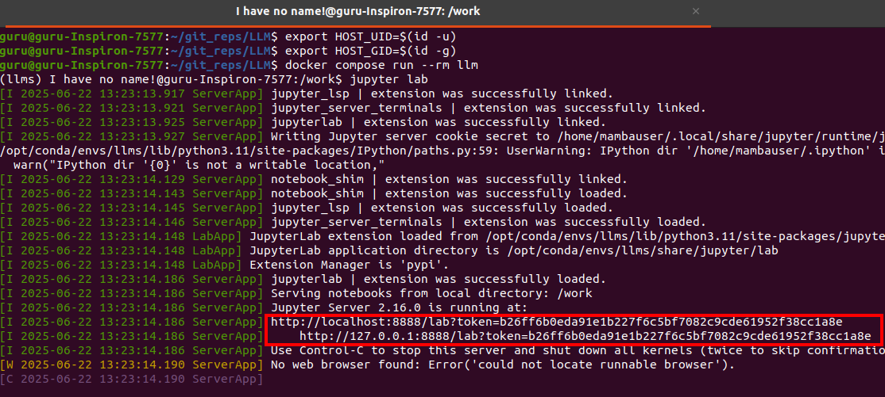

# LLM
This repository hold some quick implementation of fun projetcs using Frontier models, some of which use paid API service while other rely on open source models.

# How to run the respository
## Locally
- User's can create their own environment and install the necessary libraries on the fly

## Docker
I have already created an environment [gurudeepsingh/llm:v1](https://hub.docker.com/r/gurudeepsingh/llm/tags) containing all the libs via which user can run the repo files.
- export HOST_UID=$(id -u)
- export HOST_GID=$(id -g)
- **docker compose run --rm llm**
- jupyter lab

